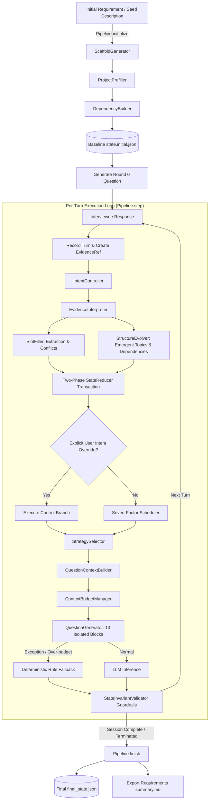

# Elicitation Core

[English](README.md) | [中文说明](README_zh.md)

[](https://www.python.org/)
[](LICENSE)

**Elicitation Core** is an enterprise-grade core engine designed for software engineering **Requirements Elicitation** through semi-structured interviews. Powered by Large Language Models (LLMs), the system combines structured evidence chain tracking, event-driven state evolution, multi-factor dynamic topic scheduling, strategy-guided question planning, deterministic context budgeting, and crash-resilient session recovery into a robust, traceable, and reproducible foundation.

---

## Table of Contents

- [1. Core Features & Design Philosophy](#1-core-features--design-philosophy)
- [2. Architecture & Workflow](#2-architecture--workflow)
- [3. Project Structure](#3-project-structure)
- [4. Storage & Runtime Artifacts](#4-storage--runtime-artifacts)
- [5. Quick Start Guide](#5-quick-start-guide)
  - [5.1 Installation & Configuration](#51-installation--configuration)
  - [5.2 CLI Tools](#52-cli-tools)
- [6. Deep Dive into Core Mechanisms](#6-deep-dive-into-core-mechanisms)
  - [6.1 Event Sourcing & Two-Phase Reducer](#61-event-sourcing--two-phase-reducer)
  - [6.2 Seven-Factor Dynamic Scheduler](#62-seven-factor-dynamic-scheduler)
  - [6.3 Six-Dimension Strategy Planning & Isolated Prompting](#63-six-dimension-strategy-planning--isolated-prompting)
  - [6.4 Context Budgeting & Graceful Fallback](#64-context-budgeting--graceful-fallback)
  - [6.5 Invariant Guardrails & Mid-Turn Recovery](#65-invariant-guardrails--mid-turn-recovery)
- [License](#license)

---

## 1. Core Features & Design Philosophy

Traditional LLM-based interview systems suffer from **factual hallucination**, **conversational topic drift**, **context window explosion**, **unresolved requirement contradictions**, and **irrecoverable session crashes**. Elicitation Core addresses these challenges via six foundational pillars:

- 🎯 **Immutable Event Sourcing**: Every state transition (slot creation, refinement, conflict revision, topic lifecycle change, dependency addition) is modeled as a strongly typed atomic `StateEvent`. The pure-function `StateReducer` enables 100% deterministic state reconstruction from disk event logs.
- 🔗 **Full-Lifecycle Evidence Traceability**: Interviewee statements are captured as immutable `EvidenceRef` records. All slot revisions (`SlotRevision`) explicitly reference supporting evidence, ensuring that every extracted requirement fact is fully auditable.
- 🧭 **Intent Control & 7-Factor Scheduling**: Handles explicit user conversational control (topic switching, topic refusal, backtracking, early termination) with confidence thresholds; dynamically evaluates candidate topics across 7 factors (prior, readiness, gap, conflict, emergence, continuity, relevance) for optimal focus.
- 💡 **Strategy-Guided Question Planning**: Decouples *what to discuss* (scheduler target) from *how to ask* (question strategy), planning targeted inquiries across six strategies: `explore`, `fill_gap`, `deepen`, `resolve_conflict`, `verify`, and `confirm_control`.
- 🛡️ **Strict Context Budgeting & Rule Fallback**: Employs a 13-block isolated prompt contract with P7~P4 priority-based progressive context trimming. If API limits are exceeded or model calls fail, the system falls back gracefully to structured heuristic templates without crashing.
- 🔒 **15 State Invariant Guardrails**: Formal business validation rules eliminate orphan slots, cross-topic data leaks, invalid state transitions, and dangling dependencies.

---

## 2. Architecture & Workflow

The interview lifecycle is orchestrated by `ElicitationPipeline`, encompassing **Initialization**, **Turn Step Loop**, and **Session Finalization**:



---

## 3. Project Structure

```text
semi_structured_interview_fse/
├── configs/
│   ├── default.example.yaml            # Canonical configuration template with full inline docs
│   └── default.yaml                    # Active local configuration file
├── docs/
│   └── configuration.md                # Comprehensive configuration guide & tuning reference
├── prompts/                            # System prompt templates
│   ├── framework_generation.txt        # Initial scaffold generation
│   ├── initial_slots_filling.txt       # Seed slot prefilling
│   ├── topic_dependency.txt            # Initial dependency identification
│   ├── intent_detection.txt            # User control intent detection
│   ├── evidence_interpretation.txt     # Cross-topic interpretation & emergence
│   ├── emergent_topic_resolution.txt   # Emergent topic creation & deduplication
│   ├── slots_filling.txt               # Slot extraction & conflict tagging
│   └── remarks_generation.txt          # Isolated strategy question generation
├── src/
│   └── elicitation_core/
│       ├── config.py                   # Pydantic V2 hierarchical configuration models
│       ├── pipeline.py                 # Core workflow orchestrator (ElicitationPipeline)
│       ├── llm/                        # Async LLM client & offline replay client
│       │   ├── client.py               # Async LLM transport with exponential retries
│       │   ├── replay_client.py        # Deterministic offline replay client from logs
│       │   ├── schemas.py              # LLM call schemas & JSON structured contracts
│       │   └── exceptions.py           # Exception hierarchy
│       ├── models/                     # Domain core data models (Pydantic V2)
│       │   ├── state.py                # ProjectState, SectionState, TopicState, SlotState, SlotRevision
│       │   ├── event.py                # StateEvent, EvidenceRef (Event sourcing & traceability)
│       │   ├── turn.py                 # TurnRecord, TurnPair (Dialogue turns)
│       │   ├── dependency.py           # DependencyEdge, TopicPriorityItem, PriorityResult
│       │   ├── interpretation.py       # EvidenceInterpretation, AffectedTopic, EmergentTopicCandidate
│       │   ├── scheduling.py           # IntentDecision, TopicSchedulingView, TopicScore, SchedulerDecision
│       │   ├── strategy.py             # StrategyCode, QuestionPlan, QuestionGenerationInput, TargetContext
│       │   ├── run_record.py           # UnifiedDecisionRecord, LLMCallRecord, RunError (Audit models)
│       │   └── updates.py              # StepResult, SlotUpdateProposal, OperationSelectionResult
│       ├── storage/                    # Storage layer: atomic snapshot writes & append-only JSONL
│       │   └── project_store.py
│       ├── services/                   # Pure service algorithms
│       │   ├── id_factory.py           # Unique identifier factory
│       │   ├── event_factory.py        # Strongly-typed immutable event builder
│       │   ├── state_reducer.py        # Two-phase transactional state reducer
│       │   ├── state_view.py           # Read-only state view & multi-factor metrics extractor
│       │   ├── question_context_builder.py # Question target context & payload assembly
│       │   ├── context_budget_manager.py   # Token budget manager & progressive P7~P4 trimming
│       │   ├── validators.py           # 15 Global state invariant validators
│       │   └── summary_generator.py    # Final Markdown requirements specification exporter
│       ├── initialization/             # Initialization domain
│       │   ├── scaffold_generator.py   # Outline & section generator
│       │   ├── prefiller.py            # Seed slot prefiller
│       │   └── dependency_builder.py   # Initial topological dependency builder
│       └── runtime/                    # Runtime interaction & reasoning domain
│           ├── evidence_interpreter.py # Evidence interpretation & cross-topic association
│           ├── structure_evolver.py    # Emergent topic resolution & dynamic dependencies
│           ├── slot_filler.py          # Slot extraction, refinement & conflict marking
│           ├── intent_controller.py    # Intent detection & confidence gating
│           ├── scheduler.py            # 7-Factor dynamic utility scheduler
│           ├── strategy_selector.py    # 6-Dimension question strategy selector
│           ├── topic_operator.py       # Topic lifecycle operator
│           ├── operation_selector.py   # Topic transition evaluator
│           └── question_generator.py   # 13-Block isolated prompt builder & generation
├── scripts/                            # Operational CLI tools
│   ├── init_project.py                 # Initialize a new interview project
│   ├── step.py                         # Advance dialogue turn
│   ├── resume.py                       # Crash recovery & session resumption
│   ├── inspect_state.py                # Inspect state snapshot & slot completion
│   └── replay.py                       # Offline state & LLM call deterministic replay
└── pyproject.toml                      # Build configuration & dependencies
```

---

## 4. Storage & Runtime Artifacts

Every interview session stores all state snapshots, events, and audit logs inside `runs/{project_id}/`:

| File | Type | Format & Purpose |
|---|---|---|
| `config_snapshot.yaml` | YAML | Sanitized runtime configuration snapshot frozen at initialization |
| `input.json` | JSON | Project creation metadata (project name, initial requirements, timestamp) |
| `state.initial.json` | JSON | Baseline state snapshot immediately following Round 0 initialization |
| `state.json` | JSON | Latest live project state snapshot (can be deleted and 100% reconstructed from events) |
| `final_state.json` | JSON | Immutable final snapshot upon session completion (`project_status = "Completed"`) |
| `summary.md` | Markdown | Automatically exported structured requirements specification document |
| `state_events.jsonl` | JSONL | Strictly monotonic, append-only immutable state event stream (Event Sourcing source of truth) |
| `evidence.jsonl` | JSONL | Raw interviewee statements with structural evidence IDs and turn indexing |
| `turns.jsonl` | JSONL | Bi-directional dialogue turn history (Interviewer / Interviewee) with strategy metadata |
| `decisions.jsonl` | JSONL | Unified decision logs recording Intent + Scheduler + Strategy contexts and scores |
| `llm_calls.jsonl` | JSONL | Complete audit log for every LLM interaction (prompts, raw responses, budgets, latency) |
| `errors.jsonl` | JSONL | Audit log of recoverable and fatal runtime exceptions with stack traces |

---

## 5. Quick Start Guide

### 5.1 Installation & Configuration

#### 1. Setup Environment
Python 3.10+ is required. We recommend using a virtual environment:

```bash
# Clone the repository
git clone <repo_url>
cd semi_structured_interview_fse

# Create and activate virtual environment
python -m venv venv
# Windows:
.\venv\Scripts\activate
# Linux/macOS:
source venv/bin/activate

# Install dependencies in editable mode
pip install -e .
```

#### 2. Initialize Configuration
Configuration templates reside in `configs/`. Copy the example file before the first run:

```bash
# Linux / macOS
cp configs/default.example.yaml configs/default.yaml

# Windows PowerShell
Copy-Item configs/default.example.yaml configs/default.yaml
```

Set your LLM API Key in your environment (or edit `configs/default.yaml` directly):
```bash
# Linux / macOS
export LLM_API_KEY="your-api-key"

# Windows PowerShell
$env:LLM_API_KEY="your-api-key"
```

> [!NOTE]
> For complete field specifications, constraints, and scenario tuning guides, refer to [docs/configuration.md](docs/configuration.md).

---

### 5.2 CLI Tools

#### 1. Initialize Interview (`init_project.py`)
```bash
python scripts/init_project.py \
  --name "Lab Equipment Sharing Platform" \
  --requirements "A university research equipment reservation system supporting online booking, hourly billing, and conflict approvals."
```
*Outputs the generated `project_id` (e.g. `proj_20260829_abc123`) and the opening exploratory question.*

#### 2. Advance Dialogue Turn (`step.py`)
```bash
python scripts/step.py \
  --project-id <PROJECT_ID> \
  --answer "The platform serves faculty, students, and external labs. Internal users get free quotas while external labs pay standard hourly fees."
```

#### 3. Inspect Current State (`inspect_state.py`)
```bash
python scripts/inspect_state.py --project-id <PROJECT_ID>
```
*Displays overall progress, section/topic statuses (Ongoing / Pending / Completed), slot values, and dependency topology.*

#### 4. Resume an Interrupted Session (`resume.py`)
If a session was interrupted by network timeouts or abrupt termination, resume idempotently:
```bash
python scripts/resume.py --project-id <PROJECT_ID>
```

#### 5. Offline Deterministic Replay (`replay.py`)
Replay historical sessions without making live LLM calls:

```bash
# Mode 1: Event stream state replay (verifies StateReducer determinism)
python scripts/replay.py --project-id <PROJECT_ID> --mode state

# Mode 2: Full LLM log replay (verifies end-to-end pipeline determinism)
python scripts/replay.py --project-id <PROJECT_ID> --mode llm
```

---

## 6. Deep Dive into Core Mechanisms

### 6.1 Event Sourcing & Two-Phase Reducer
To prevent in-memory state drift from disk logs, `StateReducer.apply()` executes a **Two-Phase Transaction**:
1. **Pre-commit Validation**: Pre-executes pending `StateEvent` records on a deep copy of the state, checking invariant pre-conditions and sequence validity;
2. **Commit Phase**: In-place mutates the live state object and atomically appends events to `state_events.jsonl`.

### 6.2 Seven-Factor Dynamic Scheduler
When the interviewee does not explicitly dictate topic transitions, `Scheduler` ranks all incomplete topics:

$$\text{Score}(T) = w_1 \cdot \text{Prior} + w_2 \cdot \text{DepReadiness} + w_3 \cdot \text{UnresolvedGap} + w_4 \cdot \text{ConflictSignal} + w_5 \cdot \text{RecentEmergence} + w_6 \cdot \text{Continuity} + w_7 \cdot \text{UserRelevance}$$

- **Prior**: Baseline outline weight;
- **DepReadiness**: Readiness based on completed prerequisite topics;
- **UnresolvedGap**: Ratio of mandatory slots remaining empty;
- **ConflictSignal**: Priority boost for topics containing conflicting statements;
- **RecentEmergence**: Exploration bonus for newly emerged topics;
- **Continuity**: Momentum bonus to keep discussions focused on active topics;
- **UserRelevance**: Semantic relevance to the interviewee's latest response.

### 6.3 Six-Dimension Strategy Planning & Isolated Prompting
`StrategySelector` determines the conversational objective for `QuestionGenerator`:
1. `explore`: Open-ended discovery when a topic is first activated;
2. `fill_gap`: Targeted inquiry targeting 1~2 empty mandatory slots;
3. `deepen`: Elaborates edge cases and boundaries when answers are shallow;
4. `resolve_conflict`: Objectively highlights contradictory facts to establish ground truth;
5. `verify`: Summarizes extracted requirements for final confirmation before topic completion;
6. `confirm_control`: Seeks explicit confirmation when user control intent has borderline confidence.

Prompts use **13 strictly isolated semantic blocks**, preventing system instructions from leaking and stopping hallucinated cross-topic assumptions.

### 6.4 Context Budgeting & Graceful Fallback
`ContextBudgetManager` applies a deterministic progressive trimming ladder (P7 ~ P4):
- **P7 Trim**: Topic catalog drops down to displaying only the active topic;
- **P6 Trim**: Cross-topic known facts drop oldest entries;
- **P5 Trim**: Conversation history trims oldest turn pairs (guaranteeing at least 1 recent pair);
- **P4 Trim**: Active topic definition drops optional (non-mandatory) slots.

If token counts still exceed caps or the LLM fails, the pipeline returns a **deterministic rule-based fallback question**, logging a `RunError` without interrupting the session.

### 6.5 Invariant Guardrails & Mid-Turn Recovery
`StateInvariantValidator` continuously enforces 15 formal rules:
- At most 1 `Ongoing` topic at any time; 0 active topics upon completion;
- Bidirectional validity across slots, topics, and sections; no orphan slots;
- Acyclic dependency graph with no self-loops or duplicate edges;
- Monotonically increasing event, decision, and turn IDs;
- Conflict-tagged slots must possess corresponding conflict revisions.

If an unexpected crash occurs mid-turn, `ElicitationPipeline.resume()` identifies the pending state and seamlessly recovers execution without generating dirty events or duplicate turn records.

---

## License

This project is licensed under the [MIT License](LICENSE).
