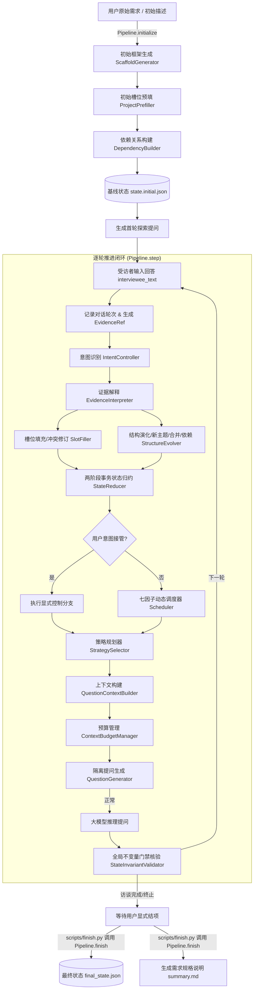

# Elicitation Core (需求半结构化访谈核心机制引擎)

[English](README.md) | [中文说明](README_zh.md)

[](https://www.python.org/)
[](LICENSE)

**Elicitation Core** 是面向软件工程需求获取（Requirements Elicitation）的半结构化访谈核心机制引擎。系统旨在通过结构化证据链追踪、事件驱动的状态演化推演、多因素动态主题调度、策略驱动的问句生成以及严格的上下文预算与容灾回退机制，为大语言模型驱动的需求访谈提供高可靠、可溯源、可复现的工业级核心底座。

---

## 目录

- [1. 核心特性与设计哲学](#1-核心特性与设计哲学)
- [2. 系统架构与工作流](#2-系统架构与工作流)
- [3. 模块架构与目录说明](#3-模块架构与目录说明)
- [4. 运行产物与存储规范](#4-运行产物与存储规范)
- [5. 快速上手指南](#5-快速上手指南)
  - [5.1 环境安装与配置](#51-环境安装与配置)
  - [5.2 核心 CLI 工具使用](#52-核心-cli-工具使用)
- [6. 核心机制详解](#6-核心机制详解)
  - [6.1 事件溯源与两阶段事务归约](#61-事件溯源与两阶段事务归约)
  - [6.2 七因子动态调度器](#62-七因子动态调度器)
  - [6.3 六维提问策略与 Prompt 隔离](#63-六维提问策略与-prompt-隔离)
  - [6.4 上下文预算管理与明确失败暴露](#64-上下文预算管理与明确失败暴露)
  - [6.5 不变量门禁与中断幂等恢复](#65-不变量门禁与中断幂等恢复)
- [开源协议](#开源协议)

---

## 1. 核心特性与设计哲学

传统基于大模型的访谈系统容易面临**事实幻觉**、**话题发散偏航**、**长上下文爆炸**、**需求矛盾无法化解**以及**会话中断不可恢复**等严峻挑战。Elicitation Core 确立了如下核心设计准则：

- 🎯 **不可变事件溯源（Event Sourcing）**：所有业务状态变更（槽位创建/填充/冲突修订、主题状态流转、依赖建立等）均由原子状态事件（`StateEvent`）驱动。通过纯函数 `StateReducer` 进行推演，支持从零事件流 100% 确定性回放与状态重建。
- 🔗 **全流程结构化证据链（Evidence Traceability）**：受访者的每次有效陈述均转换为不可变的证据引用（`EvidenceRef`），槽位版本（`SlotRevision`）严格关联支撑证据，确保导出的每条需求事实均有据可查。
- 🧭 **意图控制与多因素动态调度（Intent & 7-Factor Scheduling）**：支持受访者主动拒绝、切换话题或提前结项；结合初始先验、依赖就绪度、缺口率、冲突信号、话题涌现度、上下文连续性与用户关联度进行全局最优化主题调度。
- 💡 **六维提问策略规划（Strategy-guided Elicitation）**：解耦“聊什么”（调度目标）与“怎么问”（提问策略），针对探索、填空、深挖、化解冲突、闭环确认与意图核验等六大情境实施针对性提问规划。
- 🛡️ **严格上下文预算与明确失败暴露（Budgeting & Failure Exposure）**：13 隔离区块结构化 Prompt 契约，结合 P7~P4 优先级梯度载荷裁剪。在模型调用异常、输出为空或预算超限时，立即停止推进并暴露错误，不使用 fallback 掩盖错误，不污染未完成轮次状态。
- 🔒 **15 项全局状态不变量（State Invariant Guardrails）**：建立强类型业务门禁，杜绝孤儿槽位、跨主题数据泄漏、多活动主题等非法状态。

---

## 2. 系统架构与工作流

整个访谈生命周期由 `ElicitationPipeline` 统一编排，包含 **初始化（Initialize）**、**逐轮推进（Step Loop）** 与 **结项归档（Finish）** 三大阶段：



---

## 3. 模块架构与目录说明

```text
semi_structured_interview_fse/
├── configs/
│   ├── default.example.yaml            # 全量配置项模板与默认值参考 (可复制使用)
│   └── default.yaml                    # 运行时配置文件
├── docs/
│   └── configuration.md                # 详细配置项说明与调优参考指南
├── prompts/                            # 提示词模板层 (普通文本资源)
│   ├── framework_generation.txt        # 初始框架生成
│   ├── initial_slots_filling.txt       # 初始槽位预填
│   ├── topic_dependency.txt            # 初始依赖识别
│   ├── intent_detection.txt            # 交互控制意图识别
│   ├── evidence_interpretation.txt     # 跨主题证据解释与候选涌现
│   ├── emergent_topic_resolution.txt   # 新主题生成/合并消歧
│   ├── slots_filling.txt               # 槽位提取与冲突识别
│   └── remarks_generation.txt          # 隔离式策略提问生成
├── src/
│   ├── config.py                   # Pydantic 强类型分层配置管理与快照
│   ├── pipeline.py                 # 核心流程总编排器 (ElicitationPipeline)
│   ├── llm/                        # 异步大模型交互客户端与离线重放 Client
│   │   ├── client.py               # 异步 LLM 客户端与统一重试机制
│   │   ├── replay_client.py        # 基于录制日志的离线确定性重放客户端
│   │   ├── schemas.py              # LLM 调用契约与 JSON 结构化定义
│   │   └── exceptions.py           # 传输、输出、配置等异常体系
│   ├── models/                     # 领域核心数据模型 (Pydantic V2)
│   │   ├── state.py                # ProjectState, SectionState, TopicState, SlotState, SlotRevision
│   │   ├── event.py                # StateEvent, EvidenceRef (事件溯源与证据链)
│   │   ├── turn.py                 # TurnRecord, TurnPair (对话轮次)
│   │   ├── dependency.py           # DependencyEdge, TopicPriorityItem, PriorityResult
│   │   ├── interpretation.py       # EvidenceInterpretation, AffectedTopic, EmergentTopicCandidate
│   │   ├── scheduling.py           # IntentDecision, TopicSchedulingView, TopicScore, SchedulerDecision
│   │   ├── strategy.py             # StrategyCode, QuestionPlan, QuestionGenerationInput, TargetContext
│   │   ├── run_record.py           # UnifiedDecisionRecord, LLMCallRecord, RunError (审计模型)
│   │   └── updates.py              # StepResult, SlotUpdateProposal, OperationSelectionResult
│   ├── storage/                    # 存储层：原子文件持久化与 JSONL 顺序追加日志
│   │   └── project_store.py
│   ├── services/                   # 核心纯函数服务与算法逻辑
│   │   ├── id_factory.py           # 唯一 ID 生成工厂
│   │   ├── event_factory.py        # 强类型不可变事件构造工厂
│   │   ├── state_reducer.py        # 两阶段事务状态归约推演器
│   │   ├── state_view.py           # 只读状态视图与多因子指标提取
│   │   ├── question_context_builder.py # 提问目标上下文与结构化输入装配
│   │   ├── context_budget_manager.py   # 上下文 Token 预算测算与确定性梯度裁剪
│   │   ├── validators.py           # 15 项全局状态不变量检验门禁
│   │   └── summary_generator.py    # 结项 Markdown 需求规格生成器
│   ├── initialization/             # 初始化子域
│   │   ├── scaffold_generator.py   # 大纲与章节结构初始化
│   │   ├── prefiller.py            # 初始信息提取与槽位预填
│   │   └── dependency_builder.py   # 主题依赖拓扑构建与先验排序
│   └── runtime/                    # 运行时交互与推理子域
│       ├── evidence_interpreter.py # 证据跨主题关联与演化分析
│       ├── structure_evolver.py    # 主题动态涌现、合并与依赖边演化
│       ├── slot_filler.py          # 槽位抽取、更新与冲突标记
│       ├── intent_controller.py    # 用户交互意图识别与置信度门禁
│       ├── scheduler.py            # 七因子效用评分动态调度器
│       ├── strategy_selector.py    # 六维提问策略规划器
│       └── question_generator.py   # 结构化 Prompt 组装与问句生成
├── scripts/                            # 核心 CLI 交互工具
│   ├── init_project.py                 # 初始化访谈项目
│   ├── step.py                         # 推进对话轮次
│   ├── finish.py                       # 显式结项并生成报告
│   ├── resume.py                       # 中断恢复与状态自愈
│   ├── inspect_state.py                # 检查项目状态快照与槽位完成度
│   └── replay.py                       # 离线事件流重放 / 离线 LLM 重放
└── pyproject.toml                      # 项目构建与依赖声明
```

---

## 4. 运行产物与存储规范

每个访谈项目运行期间产生的所有状态、事件与日志，均独立持久化于 `runs/{project_id}/` 目录下，具备完整的可溯源性：

| 文件名 | 类型 | 核心作用与规范 |
|---|---|---|
| `input.json` | JSON | 原始项目创建参数（项目名称、初始输入文本等） |
| `state.initial.json` | JSON | Round 0 初始化阶段完成后的基线状态快照 |
| `state.json` | JSON | 当前最新的项目运行时状态快照（可随时删除并由事件流 100% 确定性重建） |
| `final_state.json` | JSON | 用户执行 `scripts/finish.py` 后写入的最终不可变状态快照 |
| `summary.md` | Markdown | 用户执行 `scripts/finish.py` 后生成的结构化需求规格说明书 |
| `state_events.jsonl` | JSONL | 严格按时间顺序单调追加的不可变状态事件流（Event Sourcing 主源） |
| `evidence.jsonl` | JSONL | 结构化证据记录流，完整保留用户发言及来源上下文 |
| `turns.jsonl` | JSONL | 双向对话轮次记录（Interviewer / Interviewee），关联决策 ID 与提问策略元数据 |
| `decisions.jsonl` | JSONL | 统一决策日志，记录每轮 Intent + Scheduler + Strategy 完整上下文与评分 |
| `llm_calls.jsonl` | JSONL | 全量 LLM 调用审计日志（包含完整 Prompt、原始响应、解析结构、Token 预算及耗时） |
| `errors.jsonl` | JSONL | 运行时可恢复/不可恢复异常的审计日志（包含模块、错误类型及堆栈） |

---

## 5. 快速上手指南

### 5.1 环境安装与配置

#### 1. 安装项目依赖
本项目基于 Python 3.10+ 构建。推荐使用虚拟环境进行安装：

```bash
# 克隆代码仓库并进入根目录
git clone <repo_url>
cd semi_structured_interview_fse

# 创建并激活虚拟环境
python -m venv venv
# Windows:
.\venv\Scripts\activate
# Linux/macOS:
source venv/bin/activate

# 安装依赖包 (推荐开发可编辑模式)
pip install -e .
```

#### 2. 初始化配置文件
配置文件位于 `configs/` 目录。首次运行前复制示例模板：

```bash
# Linux / macOS
cp configs/default.example.yaml configs/default.yaml

# Windows PowerShell
Copy-Item configs/default.example.yaml configs/default.yaml
```

设置大模型 API Key 环境变量（或直接在 `configs/default.yaml` 中配置）：
```bash
# Linux / macOS
export LLM_API_KEY="your-api-key"

# Windows PowerShell
$env:LLM_API_KEY="your-api-key"
```

> [!NOTE]
> 各字段详细定义、约束与典型调优场景说明，请参阅 [docs/configuration.md](docs/configuration.md)。

---

### 5.2 核心 CLI 工具使用

系统提供了 6 个标准命令行工具，支持端到端交互与离线运维：

#### 1. 初始化访谈项目 (`init_project.py`)
先准备输入 JSON 文件，例如 `project_input.json`：
```json
{
  "project_name": "高校大型仪器共享系统",
  "initial_requirements": "我们学校需要一套大型科研仪器共享管理平台，支持全校师生线上预约使用，需按小时计费，并提供设备使用冲突时的审批机制。"
}
```
然后通过 `--input`（或 `-i`）初始化项目：
```bash
python scripts/init_project.py --input project_input.json
```
如需覆盖默认的 `configs/default.yaml` 配置，可传入 `--config <CONFIG_PATH>`（或 `-c`）。

*执行成功后，终端将输出 `project_id`（例如 `proj_20260829_abc123`）及生成的首轮开放式探索提问。*

#### 2. 推进对话轮次 (`step.py`)
```bash
python scripts/step.py \
  --project-id <PROJECT_ID> \
  --answer "核心服务对象包括校内师生和校外科研单位，其中校内师生免费提供基础时长，校外人员按小时标准收费。"
```

#### 3. 手动结项并生成报告 (`finish.py`)
当 `step.py` 已返回访谈结束结果后，由用户显式执行归档命令并生成报告：
```bash
python scripts/finish.py --project-id <PROJECT_ID>
```
如果项目使用的不是默认配置文件，可传入 `--config <CONFIG_PATH>`（或 `-c`）。

该命令调用 `Pipeline.finish()`。只有已持久化项目满足以下条件时才能归档：Project 已为 `Completed`、`current_topic_id` 为空，并且所有 Topic 均为 `Completed` 或 `UserInterrupted`。条件不满足时，命令以 `ProjectNotReadyForFinalizationError` 失败；它不会完成活动 Topic、修改业务状态或生成业务状态事件。归档成功后，系统在 `runs/<PROJECT_ID>/` 下写入 `final_state.json` 和 `summary.md`。`step.py` 不会自动触发报告生成；重复执行归档命令只会根据同一份已持久化状态与证据重新生成产物，不改变访谈状态。

#### 4. 检查当前项目状态与槽位 (`inspect_state.py`)
```bash
python scripts/inspect_state.py --project-id <PROJECT_ID>
```
*打印当前项目的整体进度、各章节下各主题的状态（Pending / Ongoing / SystemInterrupted / UserInterrupted / Completed）、槽位填充详情以及已建立的主题依赖拓扑。*

#### 5. 检查并继续异常中断的项目
如果因为网络中断、预算超限、模型输出不合法或进程异常退出导致会话中止，先检查并验证已持久化状态：
```bash
python scripts/resume.py --project-id <PROJECT_ID>
```
不带额外参数时，`resume.py` 只会验证状态快照、事件流、决策与对话轮次，并显示当前会话状态。

如果异常发生前已经写入 Interviewee Turn，请在仓库根目录执行：
```bash
python scripts/resume.py --project-id <PROJECT_ID> --continue-pending
```
该命令会复用已持久化的原回答及原 Turn ID。如果继续执行再次失败，pending turn 会保留供后续重试；只有整轮成功完成后才会清除。

> [!WARNING]
> pending turn 存在时不要重新执行 `scripts/step.py --answer ...`。`step.py` 使用普通加载路径，可能重复追加 Interviewee Turn，而不是恢复已经记录的回答。

#### 6. 离线确定性重放验证 (`replay.py`)
支持在无需调用大模型 API 的情况下，对历史访谈记录进行确定性严格比对与推演校验：

```bash
# 模式一：纯事件流状态推演校验 (验证 StateReducer 与事件流确定性)
python scripts/replay.py --project-id <PROJECT_ID> --mode state

# 模式二：基于全量 LLM 日志的离线重放 (验证全链路逻辑一致性与决策日志)
python scripts/replay.py --project-id <PROJECT_ID> --mode llm
```

---

## 6. 核心机制详解

### 6.1 事件溯源与两阶段事务归约
为了杜绝内存状态与磁盘事件流发生偏移，`StateReducer.apply()` 采用 **两阶段事务验证（Two-phase Transactional Validation）**：
1. **Pre-commit 校验阶段**：在状态对象的深拷贝副本上，依次预执行待写入的 `StateEvent` 列表，严格校验事件顺序、前置状态断言及业务约束；
2. **Commit 提交阶段**：预执行完全通过后，才将变更就地（In-place）应用至当前主状态对象，并原子化追加写入 `state_events.jsonl`。

### 6.2 七因子动态调度器
当用户没有强行指定跳转话题时，系统通过 `Scheduler` 对所有未完成主题进行多维效用计算：

$$\text{Score}(T) = w_1 \cdot \text{Prior} + w_2 \cdot \text{DepReadiness} + w_3 \cdot \text{UnresolvedGap} + w_4 \cdot \text{ConflictSignal} + w_5 \cdot \text{RecentEmergence} + w_6 \cdot \text{Continuity} + w_7 \cdot \text{UserRelevance}$$

- **Prior（初始先验）**：业务大纲定义的基础权重；
- **DepReadiness（依赖就绪度）**：前序依赖主题已完成时得分最高；
- **UnresolvedGap（信息缺口）**：必填但仍为空白的槽位比例；
- **ConflictSignal（冲突信号）**：存在矛盾/冲突槽位时赋予最高调度优先级；
- **RecentEmergence（动态涌现）**：最新涌现的新需求方向优先深挖；
- **Continuity（会话连续性）**：维持当前探讨主题的顺畅度加分；
- **UserRelevance（用户相关度）**：受访者最新发言中主动提及该主题时的相关度加分。

### 6.3 六维提问策略与 Prompt 隔离
`StrategySelector` 依据状态信号产出高层决策计划，指导 `QuestionGenerator` 构造提问：
1. `explore`（初始探索）：主题首次进入时，采用开放式提问引导用户自由概述；
2. `fill_gap`（缺口填补）：聚焦 1~2 个关键必填空缺槽位进行精准定向追问；
3. `deepen`（深度挖掘）：针对不确定槽位或复杂业务分支深入澄清异常与边界条件；
4. `resolve_conflict`（冲突化解）：客观呈现已记录的矛盾点，引导受访者确认基准规则；
5. `verify`（闭环确认）：概要总结当前主题已确定的需求点，确认完备性后准备平滑过渡；
6. `confirm_control`（意图核验）：受访者发出控制意图但置信度不足时，主动向用户发起确认。

Prompt 模板采用 **13 个严格语义区块隔离设计**，隔离系统指令、当前聚焦目标（TargetContext）、跨主题已知事实（Known Info）、历史对话上下文与输出约束，有效杜绝模型偏题与指令泄漏。

### 6.4 上下文预算管理与明确失败暴露
`ContextBudgetManager` 设定全局及单区块 Token 上限。当输入内容超限时，按照既定梯度实施确定性削减：
- **P7 削减**：主题目录（Topic Catalog）降级至仅保留当前主题；
- **P6 削减**：裁剪最旧的跨主题已知事实；
- **P5 削减**：对话历史窗口滑动裁剪（保证至少保留最新一轮 Q&A 对）；
- **P4 削减**：裁剪当前主题的非必需/可选槽位。

若核心关键上下文仍然超限，或遭遇 LLM 接口异常/超时/空输出，系统直接抛出明确异常，记录 `RunError` 审计日志，不向磁盘提交该轮的 Evidence、StateEvent、Decision、Interviewer Turn 或 `state.json`。挂起的 Interviewee Turn 可在调整预算配置后通过 resume 安全重试并继续推进。

### 6.5 不变量门禁与中断幂等恢复
系统通过 `StateInvariantValidator` 实时检验 15 项核心业务不变量：
- 全局至多存在 1 个正在进行的主题（`Ongoing`），结项后无任何活动主题；
- 所有槽位、章节引用必须双向有效且无孤儿；
- 依赖图禁止自依赖（Self-loop）与重复边；
- 事件 ID、决策 ID、轮次 ID 全局单调递增且唯一；
- 冲突状态槽位必须包含至少一条冲突修订版本。

当异常发生在 Interviewee Turn 已写入、但整轮尚未提交时，`ElicitationPipeline.resume()` 会把位于 `state.turn_index + 1` 的最后一条 Interviewee Turn 识别为 pending。随后调用不带新回答的 `step()`，即可复用原回答和原 Turn ID；冲突的新输入会被拒绝，连续失败不会清除 pending，只有整轮成功后才会清除。实际继续方式请使用快速上手章节中的 `resume.py --continue-pending`；不带该参数时，`resume.py` 只负责验证并显示中断状态。

---

## 开源协议

本项目采用 [MIT License](LICENSE) 开源协议。
